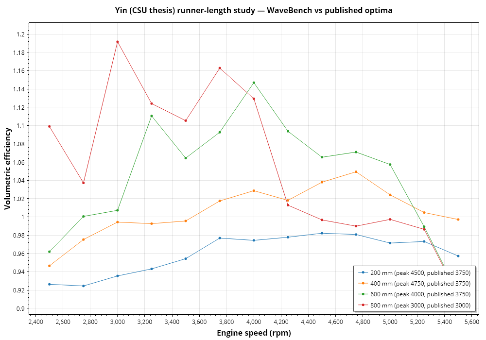

# WaveBench

[](https://github.com/TokenGoblin/WaveBench/actions/workflows/ci.yml)

Laboratory-grade 1D engine gas-dynamics, acoustics and forced-induction design suite.

- **Platform:** .NET 10 (LTS), Windows-native (WinUI 3 / Windows App SDK)
- **Licence:** Apache-2.0
- **Audience:** Formula SAE teams, race engine developers, professional engine designers, DIY engine enthusiasts
- **Scope:** intake and exhaust wave tuning · camshaft timing · collector configuration and cylinder pairing · exhaust sound design and auralisation · turbocharging and supercharging · multi-objective optimisation

**No telemetry. No network calls at runtime.** Your designs, dyno data and
audio never leave your machine.

## Status

**Phases 0–10 complete.** The complete build specification
lives in [`docs/WaveBench-Master-Plan.md`](docs/WaveBench-Master-Plan.md) — a
staged build contract with 26 phases, each with a hard acceptance gate.
Physics before pixels: Phases 0–15 produce a headless, test-covered,
validated engine; no UI exists before Phase 16.

What works today: species-resolved 1D gas dynamics (MUSCL-Hancock + HLLC,
verified against exact Riemann solutions), well-balanced variable area,
friction/heat/wall-thermal sources, reservoir/orifice/plenum/junction
components, an FSAE restrictor that chokes at theory, motored and fired
single/multi-cylinder engines with wave-tuned VE curves, Wiebe combustion
with knock tracking, a transfer-matrix acoustics engine cross-validated
against the nonlinear solver to 0.45 dB, collector pulse-timing analysis
that reproduces the crossplane-vs-flat-plane signature from firing order
alone, **audio synthesis** (phase-coherent crank-angle wavetables, BS.1770
level-matched A/B, WAV export with provenance), and a CLI that runs models,
sweeps, mesh studies, renders audio and executes the validation suite.

## Headless CLI

```
wavebench info   examples/single-360.json
wavebench run    examples/single-360.json --rpm 5000
wavebench sweep  examples/single-360.json --from 4000 --to 9000 --step 500 \
                 --db results.db --plot sweep.png
wavebench mesh   examples/single-360.json --rpm 7000
wavebench render examples/single-360.json --from 2500 --to 7500 --seconds 9
wavebench validate --out validation
```

`render` solves an rpm grid, builds crank-angle wavetables from the solved
pressure history and synthesises phase-coherent audio — 24-bit/48 kHz WAV
with separate exhaust/intake stems and a provenance sidecar recording the
model hash, seed and resolved bandwidth. Content above that bandwidth is
labelled as not physically resolved rather than presented as prediction.

## Validation

Every claim is backed by a committed comparison (see `validation/` and
`docs/physics.md`). First published-data case: the open-access CSU thesis
runner-length study — WaveBench reproduces the published optimum exactly at
800 mm and within the 250 rpm gate at 600 mm:



Have dyno data with known geometry (especially FSAE)? Please open an issue —
a measured case with provenance is the most valuable contribution this
project can receive.

## Building

```
dotnet build
dotnet test
```

Requires the .NET 10 SDK. The desktop app project is a placeholder until
Phase 16; everything else is cross-buildable class libraries plus a CLI.

## Solution layout

| Project | Purpose |
|---|---|
| `WaveBench.Core` | Physics: thermodynamics, 1D solver, components, engine model (no UI, no I/O beyond streams) |
| `WaveBench.Acoustics` | TMM, radiation, order analysis, psychoacoustics, synthesis |
| `WaveBench.Boost` | Turbo/supercharger maps, shaft dynamics, thermal states, boost control |
| `WaveBench.Model` | Serialisable model tree, strongly-typed units, validation rules, provenance |
| `WaveBench.Analysis` | Post-processing, FFT, wave decomposition |
| `WaveBench.Optimize` | DOE, optimisers, surrogates, constraints |
| `WaveBench.Cli` | Headless runner and scripting entry point |
| `WaveBench.App` | WinUI 3 desktop app (Phase 16+) |

Tests: `WaveBench.Core.Tests` (unit), `WaveBench.Verification` (§6.1, per-PR
CI), `WaveBench.Validation` (§6.2, nightly), `WaveBench.Bench`
(BenchmarkDotNet).

## Ground rules (from the plan, Part 0)

1. Do not skip phases; every gate must pass before proceeding.
2. TDD is mandatory in the physics layers, tested against analytical or published references.
3. Every empirical correlation is cited in an XML doc comment with its validity range.
4. `WaveBench.Core` never references a UI assembly (enforced by an architecture test).
5. Determinism: same input file → bit-identical results.
6. Docs ship in the same commit as the code.
